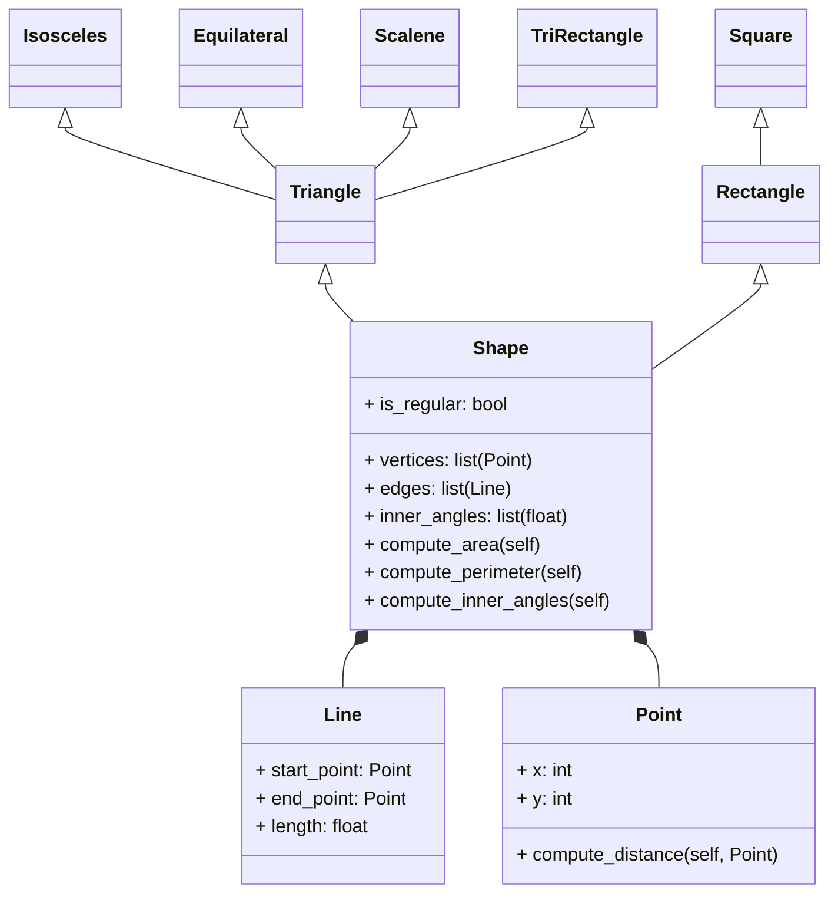

# Reto cuatro
## Punto uno
Hacer el ejercicio de la clase.

**Ejercicio**

1. Create a superclass called Shape(), which is the base of the classes Reactangle() and Square(), define the methods compute_area and compute_perimeter in Shape() and then using polymorphism redefine the methods properly in Rectangle and in Square.

**Código**

```
class Shape: #Clase base
    def __init__(self):
        pass
    
    def compute_area(self):#Se define el método  para calcular área
        pass

    def compute_perimeter(self):#Se define el método para calcular perímetro
        pass
    
class Rectangle(Shape): #Subclase
    def __init__(self, length:float, width:float):
        super().__init__() #Llamando métodos de la clase base
        self.length = length
        self.width = width

    def compute_area(self): #Poliformismo
        return self.length*self.width #Se implementa un comportamiento propio del rectángulo para el método
    
    def compute_perimeter(self): #Poliformismo
        return self.length*2+self.width*2 #Se implementa un comportamiento propio del rectángulo para el método
    
class Square(Shape): #Subclase
    def __init__(self, length:float):
        super().__init__() #Llamando métodos de la clase base
        self.length = length

    def compute_area(self): #Poliformismo
        return self.length**2 #Se implementa un comportamiento propio del cuadrado para el método
    
    def compute_perimeter(self): #Poliformismo
        return self.length*4 #Se implementa un comportamiento propio del cuadrado para el método

```

2. Using the classes Point() and Line() define a new super-class Shape() with the following structure:


Use Inheritance, Composition, Encapsulation and Polymorphism to define the classes. All attributes must have their respective setters and getters.

**Código**

```

```
