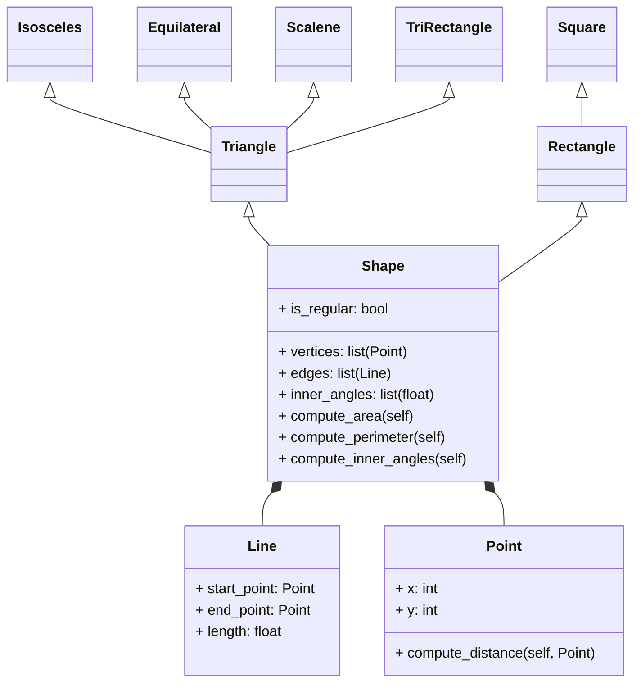

# Reto cuatro
## Punto uno
Hacer el ejercicio de la clase.

**Ejercicio**

1. Create a superclass called Shape(), which is the base of the classes Reactangle() and Square(), define the methods compute_area and compute_perimeter in Shape() and then using polymorphism redefine the methods properly in Rectangle and in Square.

**Código**

```
class Shape: #Clase base
    def __init__(self):
        pass
    
    def compute_area(self):#Se define el método  para calcular área
        pass

    def compute_perimeter(self):#Se define el método para calcular perímetro
        pass
    
class Rectangle(Shape): #Subclase
    def __init__(self, length:float, width:float):
        super().__init__() #Llamando métodos de la clase base
        self.length = length
        self.width = width

    def compute_area(self): #Poliformismo
        return self.length*self.width #Se implementa un comportamiento propio del rectángulo para el método
    
    def compute_perimeter(self): #Poliformismo
        return self.length*2+self.width*2 #Se implementa un comportamiento propio del rectángulo para el método
    
class Square(Shape): #Subclase
    def __init__(self, length:float):
        super().__init__() #Llamando métodos de la clase base
        self.length = length

    def compute_area(self): #Poliformismo
        return self.length**2 #Se implementa un comportamiento propio del cuadrado para el método
    
    def compute_perimeter(self): #Poliformismo
        return self.length*4 #Se implementa un comportamiento propio del cuadrado para el método

```

2. Using the classes Point() and Line() define a new super-class Shape() with the following structure:


Use Inheritance, Composition, Encapsulation and Polymorphism to define the classes. All attributes must have their respective setters and getters.

**Código**

```
import math #importando math 

ARCOCOSENO = math.acos #Declarando arcocoseno como una constante
GRADOS = math.degrees #Declarando la conversión de radianes a grados como una constante

class Point:
    def __init__(self, x:int, y:int):
        self.__x = x
        self.__y = y
    
    # Setter x
    def set_x(self, new_x):
        self.__x = new_x

    # Getter x
    def get_x(self):
        return self.__x

    # Setter y
    def set_y(self, new_y):
        self.__y = new_y

    # Getter y
    def get_y(self):
        return self.__y
    
    def compute_distance(self, Point):
        return ((self.__x-Point.__x)**2+(self.__y-Point.__y)**2)**0.5 #Formula para calcular distancia entre dos puntos
    
class Line:
    def __init__(self, start_point:Point, end_point:Point): #Hay composición: una línea tiene dos puntos
        self.__start_point = start_point
        self.__end_point = end_point
        self.__length = start_point.compute_distance(end_point) #Length se cálcula con el método compute_distance de la clase Point

    # Setter start point
    def set_start_point(self, new_start_point):
        self.__start_point = new_start_point

    # Getter start point
    def get_start_point(self):
        return self.__start_point
    
    # Setter end point
    def set_end_point(self, new_end_point):
        self.__end_point = new_end_point

    # Getter end point
    def get_end_point(self):
        return self.__end_point
    
    # Setter length
    def set_length(self, new_length):
        self.__length = new_length

    # Getter length
    def get_length(self):
        return self.__length
    
class Shape: #Clase base
    def __init__(self, is_regular:bool, vertices:list=[Point], edges:list=[Line]):
        self.__is_regular = is_regular 
        self.__vertices = vertices
        self.__edges = edges

    # Setter is regular
    def set_is_regular(self, new_is_regular):
        self.__is_regular = new_is_regular

    # Getter is regular
    def get_is_regular(self):
        return self.__is_regular
    
    # Setter vertices
    def set_vertices(self, new_vertices):
        self.__vertices = new_vertices

    # Getter vertices
    def get_vertices(self):
        return self.__vertices
    
    # Setter edges
    def set_edges(self, new_edges):
        self.__edges = new_edges

    # Getter edges
    def get_edges(self):
        return self.__edges
    
    def compute_area(self): #Se define el método para calcular área
        pass

    def compute_perimeter(self): #Se define el método para calcular perímetro
        pass
    
    def compute_inner_angles(self): #Se define el método para calcular ángulos internos
        pass

class Triangle(Shape): #Subclase
    def __init__(self, is_regular:bool, vertices:list=[Point], edges:list=[Line]):
        super().__init__(is_regular, vertices, edges) #Llamando atributos y métodos de la clase base
    
    def compute_area(self):#Polimorfismo
        #Para calcular el área de los triangulos se usa la fórmula de Herón
        #Formula de Herón:(s(s-a)(s-b)(s-c))**0.5, donde s=(a+b+c)/2
        x = 0
        sum = 0 #suma de la longitud de todos los lados del triángulo
        while x<len(self.get_edges()):
            sum+=self.get_edges()[x].get_length()
            x+=1
        s = sum/2 #Se calcula s 
        area = (s*(s-self.get_edges()[0].get_length())*(s-self.get_edges()[1].get_length())*(s-self.get_edges()[2].get_length()))**0.5
        #Se usa la formula de Herón
        return area

    def compute_perimeter(self):#Polimorfismo
        x = 0
        sum = 0 #suma de la longitud de todos los lados del triángulo
        while x<len(self.get_edges()):
            sum+=self.get_edges()[x].get_length()
            x+=1
        return sum

    def compute_inner_angles(self):#Polimorfismo
        #Para calcular los ángulos se usa la ley del coseno
        #a,b y c corresponden a cada uno de los lados del triángulo
        a = self.get_edges()[0].get_length()
        b = self.get_edges()[1].get_length()
        c = self.get_edges()[2].get_length()
        #Se obtiene cada uno de los ángulos con teniendo en cuenta la fórmula: a^2=b^2+c^2-2bc*cosA
        angle_a = round(GRADOS(ARCOCOSENO((a**2-b**2-c**2)/(-2*b*c))))
        angle_b = round(GRADOS(ARCOCOSENO((b**2-a**2-c**2)/(-2*a*c))))
        angle_c = round(GRADOS(ARCOCOSENO((c**2-b**2-a**2)/(-2*a*b))))
        return [angle_a, angle_b, angle_c]

class Isosceles(Triangle):#Subclase
    def __init__(self, is_regular: bool, vertices: list = [Point], edges: list = [Line]):
        super().__init__(is_regular, vertices, edges)#Llamando atributos y métodos de la clase base

class Equilateral(Triangle):#Subclase
    def __init__(self, is_regular: bool, vertices: list = [Point], edges: list = [Line]):
        super().__init__(is_regular, vertices, edges)#Llamando atributos y métodos de la clase base

    def compute_perimeter(self):#Polimorfismo
        if self.get_is_regular()==True:
            return self.get_edges()[0].get_length()*3#El perimetro de un triángulo equilatero es cualquier lado multiplicado por 3
        else:
            return "The triangle should be regular."
        
    def compute_inner_angles(self):#Poliformismmo
        if self.get_is_regular()==True:#Todos los ángulos de un triángulo equilatero miden 60 grados
            return [60, 60, 60]
        else:
            return "The triangle should be regular."

class Scalene(Triangle):#Subclase
    def __init__(self, is_regular: bool, vertices: list = [Point], edges: list = [Line]):
        super().__init__(is_regular, vertices, edges)#Llamando atributos y métodos de la clase base

class Rectangle(Shape):#Subclase
    def __init__(self, is_regular:bool, vertices:list=[Point], edges:list=[Line]):
        super().__init__(is_regular, vertices, edges)#Llamando atributos y métodos de la clase base

    def compute_area(self):#Polimorfismo
        #Se obtienen las coordenadas del último punto de la primera línea dada
        vertice_x = self.get_edges()[0].get_end_point().get_x()
        vertice_y = self.get_edges()[0].get_end_point().get_y()
        x = 0
        while x<len(self.get_edges()):
            #Se busca la línea que tiene como primer punto las mismas coordenadas que el último punto de la primera linea dada
            #Lo anterior se hace para asegurarse de que se multipliquen la base y la altura del rectángulo y no los lados paralelos
            if self.get_edges()[x].get_start_point().get_x()==vertice_x and self.get_edges()[x].get_start_point().get_y()==vertice_y:
                area = self.get_edges()[0].get_length()*self.get_edges()[x].get_length() #Se multiplican la base y la altura del rectángulo
                return area
            else:
                x+=1

    def compute_perimeter(self):#Polimorfismo
        x = 0
        sum = 0#suma de la longitud de todos los lados del triángulo
        while x<len(self.get_edges()):
            sum+=self.get_edges()[x].get_length()
            x+=1
        return sum
    
    def compute_inner_angles(self):#Polimorfismo
        return [90, 90, 90, 90]#Todos los ángulos de un rectángulo miden 90 grados
    
class Square(Rectangle):#Subclase
    def __init__(self, is_regular:bool, vertices:list=[Point], edges:list=[Line]):
        super().__init__(is_regular, vertices, edges)#Llamando atributos y métodos de la clase base

    def compute_area(self):#Polimorfismo
        if self.get_is_regular()==True:
            return self.get_edges()[0].get_length()**2#El área de un cuadrado es la longitud de cualquier elevado al cuadrado
        else:
            return "The square should be regular."
    
    def compute_perimeter(self):#Polimorfismo
        if self.get_is_regular()==True:
            return self.get_edges()[0].get_length()*4#El perimetro de un cuadrado es la longitud de cualquier lado multiplicado por 4
        else:
            return "The square should be regular."
```

## Punto dos

**The restaurant revisted**

* Add setters and getters to all subclasses for menu item
* Override calculate_total_price() according to the order composition (e.g if the order includes a main course apply some disccount on beverages)
* Add the class Payment() following the class example

**Código**

```
class MenuItem: #Clase base
    def __init__(self, name, price):
        self.__name = name
        self.__price = price

    #Setter name
    def set_name(self, new_name):
        self.__name = new_name

    #Getter name
    def get_name(self):
        return self.__name
    
    #Setter price
    def set_price(self, new_price):
        self.__price = new_price

    #Getter price
    def get_price(self):
        return self.__price
    
class Beverage(MenuItem):#Subclase
    def __init__(self, name, price, alcohol, temperature):
        super().__init__(name, price)#Llamando atributos de la clase base
        self.__alcohol = alcohol
        self.__temperature = temperature

    #Setter alcohol
    def set_alcohol(self, new_alcohol):
        self.__alcohol = new_alcohol

    #Getter alcohol
    def get_alcohol(self):
        return self.__alcohol
    
    #Setter temperature
    def set_temperature(self, new_temperature):
        self.__temperature = new_temperature

    #Getter temperature
    def get_temperature(self):
        return self.__temperature
    
class MainCourse(MenuItem):#Subclase
    def __init__(self, name, price, vegetarian, spicy):
        super().__init__(name, price)#Llamando atributos de la clase base
        self.__vegetarian = vegetarian
        self.__spicy = spicy

    #Setter vegetarian
    def set_vegetarian(self, new_vegetarian):
        self.__vegetarian = new_vegetarian
    
    #Getter vegetarian
    def get_vegetarian(self):
        return self.__vegetarian
    
    #Setter spicy
    def set_spicy(self, new_spicy):
        self.__spicy = new_spicy
    
    #Getter spicy
    def get_spicy(self):
        return self.__spicy
    
class Dessert(MenuItem):#Subclase
    def __init__(self, name, price, peanuts, vegan):
        super().__init__(name, price)#Llamando atributos de la clase base
        self.__peanuts = peanuts
        self.__vegan = vegan

    #Setter peanuts
    def set_peanuts(self, new_peanuts):
        self.__peanuts = new_peanuts
    
    #Getter peanuts
    def get_peanuts(self):
        return self.__peanuts
    
    #Setter vegan
    def set_vegan(self, new_vegan):
        self.__vegan = new_vegan
    
    #Getter vegan
    def get_vegan(self):
        return self.__vegan

class Order:
    def __init__(self, order_list: list = []):
        self.order_list = order_list

    def add_items(self, new_items_list: list = []):
        x = 0
        while x<len(new_items_list):
            self.order_list.append(new_items_list[x])#The new items are added to the original order list
            x+=1

    def calculate_total_price(self):
        x = 0
        sum = 0 #The variable is for adding all the prices of the items that are in order_list
        while x<len(self.order_list):
            sum+=self.order_list[x].get_price()
            x+=1
        if self.order_list.count(beer)>=3:#There is a discount for the beers: buy 3, get 1 free
            beer_count = self.order_list.count(beer)
            beer_discount = (beer_count//3)
            sum-=(beer.get_price()*beer_discount)
        print("The total price is $" +str(sum)) 
    
class Payment:#Clase base
    def __init__(self):
        pass

    def pay(self, price):#Se define el método para pagar
        pass

class Tarjeta(Payment):#Subclase
    def __init__(self, card_number, cvv):
        super().__init__()#Llamando atributos de la clase base
        self.card_number = card_number
        self.cvv = cvv
    
    def pay(self, price):#Polimorfismo
        print("Paying " + str(price)+" with credit card.")

class Cash(Payment):#Subclase
    def __init__(self, given_cash:float):
        super().__init__()#Llamando atributos de la clase base
        self.given_cash = given_cash

    def pay(self, price:float):#Polimorfismo
        if self.given_cash>price:
            print("Cash payment accepted. Change: $" + str(self.given_cash-price))
        elif price>self.given_cash:
            print("Cash payment denied. There are missing: $"+ str(price-self.given_cash))
        else:
            print("Cash payment accepted. There is no change.")

beer = Beverage("Beer", 10.000, "Alcoholic", "Cold" )
water = Beverage("Bottle of water", 6.500, "Non-alcoholic", "Room temperature" )
soda = Beverage("Coca-Cola", 6.000,"Non-alcoholic", "Cold" )
coffee = Beverage("Cappuccino", 6.100, "Non-alcoholic", "Hot" )
salad = MainCourse("Caesar salad", 23.000, "Non-vegetarian", "Non-spicy" )
lasagna = MainCourse("Lasagna", 25.000, "Vegetarian", "Non-spicy")
tacos = MainCourse("Chicken Tacos", 20.000, "Non-vegetarian", "Spicy")
waffle = Dessert("Nutella waffles", 15.000, "Contains peanuts", "Non-vegan" )
iceCream = Dessert("Lemon ice cream", 5.000, "Without peanuts", "Vegan" )
tiramisu = Dessert("Tiramisu", 12.000, "Without peanuts", "Non-vegan")


order = Order([waffle, salad, beer])
order.calculate_total_price()
order.add_items([beer, lasagna, tacos, beer, iceCream])
order.calculate_total_price()

paying_order = Cash(200)
paying_order.pay(103) 
```
